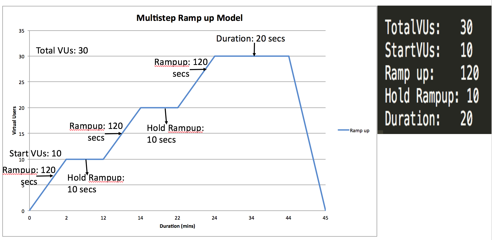
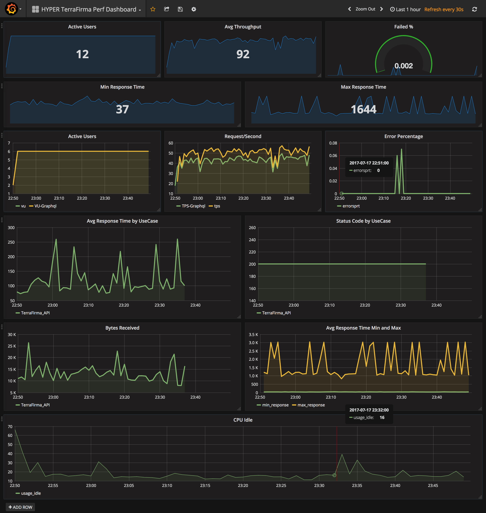

## **Getting Started**

### **Prerequisites**

1.  Start by creating a **GIT Repository** (**[sample](https://gecgithub01.walmart.com/pkumaar/Hyper_Demo.git)**) with Public access
2.  Add a **.perf** (**[sample](https://gecgithub01.walmart.com/pkumaar/Hyper_Demo/blob/master/.perf)**) file on the GIT Repo using these [guidelines](about:blank#GettingStarted-Creatinga.perfFile) 
3.  [D](about:blank#GettingStarted-Creatinga.perfFile)rop in any **CSV Data** files, if any are required, into the GIT Repo

**Note: [perf.json](about:blank#GettingStarted-Creatinga.jsonFile)** can be used instead of .perf. Or, if you have existing ***.jmx (Jmeter Test Plan)** you can drop that file directly and run tests without creating a .perf file.

### **Step-by-Step Guide**

1.  Go to webpage: **[http://hyper.walmart.com/](http://hyper.walmart.com/)**

2.  Add Project (for a brand new project, or use: **[http://hyper.walmart.com/create](http://hyper.walmart.com/create)**)

    1.  Project Name – **Do not use ‘-’ in the project name, use ‘_’** instead.****  

        1.  ****Note:**** Use the same name as the project name field in .perf or perf.json file
    2.  GIT Repo URL – Provide the GIT Repo HTTPS endpoint (don’t provide “SSH” git link. **Also GIT Repo needs to be Public**)
    3.  Email Id – For sending the performance report (Use comma separated to provide multiple email ids)
    4.  Hit **“Add Project”**
3.  Execute Performance Test: **[http://hyper.walmart.com/](http://hyper.walmart.com/)**
    1.  Project Name – Select your Project
    2.  GIT Repo URL – Provide the GIT Repo HTTPS endpoint (don’t provide “SSH” git link. **Also GIT Repo needs to be Public**)
    3.  Email Id – For sending the performance report (Use comma separated to provide multiple email ids)
    4.  Hit **“Execute”**
    5.  After test is done you will get the report via SLACK and also on Email

4.  Performance Test Status

    1.  Tests Queue – Shows performance tests lined up or waiting for execution

    2.  Tests Running – Shows the performance tests that are currently executing

5.  Performance Trend Graphs

    1.  **Throughput** - shows the throughput graph between tests
    2.  **Response Time** - shows Average, Median and 90th percentile of the selected project between test executions
    3.  **Percentage of Errors** - shows the error percentage for each test execution
6.  Monitoring
    1.  Set up RealTime Monitoring using **Medusa**

**How-to Steps & Guidelines**

#### **Creating a .perf File**

You need to follow the** specific order and syntax while creating**

**Between the Field and Value ****tab is the separator after the “:”**

**Project Name:**(Followed by tab) ProjectName. **Git Repository Name and Project Name needs to be same. Avoid space use someother symbols instead in project name.**

**Method:**  **GET or POST** (Two Methods only allowed)

**TotalVUs:    **Total Number of users you like to execute in parallel for this use case (At least 2 users min). **Max 50 VUs** **If you provide any value above 50 VUs we will make it to default 50 VUs.**

**StartVUs:** How many users you want to Start with and continue the same ramp up model till you reach TotalVUs. **Max 50 VUs** **If you provide any value above 50 VUs we will make it to default 50 VUs.**

**Hold Rampup:** How long you want to hold with the Started Users **(mins)**. **You can run the test for Max of 1 Hour. If you provide any value above 1 Hr we will make it to default 1 Hr.**

**Duration:** After Ramping up all the Total users how long you want to hold **(mins)**. **You can run the test for Max of 1 Hour. If you provide any value above 1 Hr we will make it to default 1 Hr.**

**Ramp up:** Time to Ramp up the mentioned StartVUs for each ramp (secs)

**API Name:**     Name of the API

**Data files:**   **(Optional)** If you have any data files it needs to be in **csv format with only one column**. You can provide multiple data files with comma as separator. For using the data file anywhere as part of the Request/Headers just replace the value with **{name of the csv file}**

**URL:** **End point to hit** **without http:// or https://**

**Body:**    Its applicable only for **POST Method****. **Parameters you like to pass it needs to be in **Raw Source format in single line.**

**Protocol:**     **HTTPS or HTTP** (**Optional if you wont provide it will consider as HTTP protocol by default**)

**Port:**     **You can specify your own port numbers** (**Optional if you wont provide it will consider as 80 port by default**)

**Headers:** **HeaderName:Value**** (Optional. If you like to provide multiple headers use tab as separator all the headers value needs to be in single line)**

**Parse:  VariableName:'regex pattern':matchcount **(eg: Parse:  links:'href="(.+?)"':2 - Link variable will have the value of the second link from the response. if you mention matchcount as -1 it will store all the values in an array)

**Wait:**     **You can specify wait time in ms between requests **(**Optional**)

**Last line need to end with blank Line**

You can also have multiple requests in the same project. While executing the performance test all will execute in parallel with the defined workload pattern.

You can also create a Flow/Sequence/Transaction by without leaving any blank line - [GOP_AccountClient_AddAddress](https://gecgithub01.walmart.com/pkumaar/GOP_AccountClient_AddAddress/blob/master/.perf)

GIT sample of .perf file - [Hyper_Demo](https://gecgithub01.walmart.com/pkumaar/Hyper_Demo/blob/master/.perf)

[Hyper Uses Multi Step Ramp up Model - Sample ](https://gecgithub01.walmart.com/pkumaar/Hyper_Demo/blob/master/.perf)



**Examples:**

**Project with 1 Request**

```
Project Name:	Perf_Auto_Test
Method:	GET
TotalVUs:	20
StartVUs:	4
Hold Rampup:	10
Duration:	10
Ramp up:	1
API Name:	test1
Data files:	zipcode.csv,skuid.csv
URL:	grocery-api.stage.grocery-api.prod.walmart.com/v2/api/serviceAvailability?postalCode=${zipcode}&fulfillmentType=ALL&&&radius=35&testStores=true&
Protocol:	HTTPS
```

**Project with 2 Requests. Also contains post Method example**

```js
Project Name: Auto_Script
Method: GET
TotalVUs: 20
StartVUs: 4
Hold Rampup: 10
Duration: 10
Ramp up: 1
API Name: ProductAPI
Data files: skuid.csv
URL: grocery - api.stage.grocery - api.prod.walmart.com / v2 / api / products / $ {
  skuid
}
Protocol: HTTPS

Method: POST
TotalVUs: 50
StartVUs: 10
Hold Rampup: 10
Duration: 30
Ramp up: 5
API Name: ShippingAPI
URL: read - service.stg.ship.services.glb.stg.walmart.com / ship - read - service / v1 / fulfillment - methods
Body: {
  "payload": {
    "correlationId": "123",
    "programs": [{
      "name": "SHIPPINGPASS",
      "value": "SUBSCRIBED"
    }],
    "offerFulfillmentQueryList": [{
      "offerId": "E7110EB3B8A54D6C807514B1D76671CF",
      "sellerId": "8E3EC82C234B4A5D9D1C2AA8007C2B4E",
      "sellerType": "EXTERNAL",
      "rhPath": "7043:7044:9868:7593:5110",
      "customerShippingAddress": {
        "zipCode": "35004",
        "stateCode": "AL",
        "isPoBox": "N"
      },
      "storeShippingAddressList": []
    }, {
      "offerId": "0000282796E94C319753B01CFBBA32B6",
      "sellerId": "F55CDC31AB754BB68FE0B39041159D63",
      "sellerType": "INTERNAL",
      "rhPath": "7043:7052:10718:10719:7668",
      "customerShippingAddress": {
        "zipCode": "85001",
        "stateCode": "AZ",
        "isPoBox": "N"
      },
      "storeShippingAddressList": [{
        "storeShippingAddress": {
          "zipCode": "71601",
          "stateCode": "AR",
          "isPoBox": "N"
        },
        "storeId": 1001
      }, {
        "storeShippingAddress": {
          "zipCode": "90001",
          "stateCode": "CA",
          "isPoBox": "N"
        },
        "storeId": 1001
      }, {
        "storeShippingAddress": {
          "zipCode": "80001",
          "stateCode": "CO",
          "isPoBox": "N"
        },
        "storeId": 1001
      }, {
        "storeShippingAddress": {
          "zipCode": "06001",
          "stateCode": "CT",
          "isPoBox": "N"
        },
        "storeId": 1001
      }, {
        "storeShippingAddress": {
          "zipCode": "19701",
          "stateCode": "DE",
          "isPoBox": "N"
        },
        "storeId": 1001
      }]
    }]
  }
}
Protocol: HTTP
Headers: WM_SVC.VERSION: 1.0 .0 WM_CONSUMER.IP: 127.0 .0 .1 WM_SVC.ENV: DEV WM_SEC.AUTH_TOKEN: AHHA WM_SVC.NAME: ABC WM_CONSUMER.INTIMESTAMP: 1335916114312 Accept: application / json WM_CONSUMER.ID: 2342424 WM_IFX.CLIENT_TYPE: INTERNAL Content - Type: application / json
Wait: 500
```

**Project with 1 Flow with multiple requests and 1 Request**

```js
Project Name: GOP_AccountClient
Method: POST
TotalVUs: 20
StartVUs: 2
Hold Rampup: 1
Duration: 30
Ramp up: 1
API Name: GOP_CreateAccount
Data files: NewUser.csv
URL: mustang - stg.walmart.com / v3 / api / customer ? customerFields = all
Body: {
  "firstName": "test",
  "lastName": "user",
  "emailAddress": "${NewUser}@test.com",
  "password": "test1234",
  "acceptTermsConditions": true,
  "primaryPhoneNumber": "1234567891",
  "address": {
    "line1": "450 N Mathilda ave",
    "line2": "M302",
    "city": "sunnyvale",
    "state": "CA",
    "postalCode": "94085",
    "secondaryPhoneNumber": "1234567890",
    "displayLabel": "mn",
    "isDefault": true,
    "deliveryInstructions": "check"
  },
  "storeId": 0,
  "accessPointId": "baa62b6c-3357-436c-b45f-7c947175fd6d",
  "emailPreference": true
}
Headers: Content - Type: application / json
Method: POST
API Name: GOP_AccountClient_AddAddress
Data files: Line1.csv, Line2.csv, City.csv, Postal.csv
URL: mustang - stg.walmart.com / v3 / api / customer / address
Body: {
  "line1": "${Line1}",
  "line2": "${Line2}",
  "city": "${City}",
  "state": "CA",
  "postalCode": "${Postal}",
  "primaryPhoneNumber": "1234567890",
  "displayLabel": "mn",
  "isDefault": true,
  "deliveryInstructions": ""
}
Headers: Content - Type: application / json
Method: POST
API Name: GOP_AccountClient_Updateddress
Data files: Line1.csv, Line2.csv, City.csv, Postal.csv, PhNo.csv
URL: mustang - stg.walmart.com / v3 / api / customer / address / 245 aa99c - 9 b87 - 4e d5 - 80 d4 - bf7c9d6aa3fe
Body: {
  "line1": "${Line1}",
  "line2": "${Line2}",
  "city": "${City}",
  "state": "CA",
  "postalCode": "${Postal}",
  "primaryPhoneNumber": "${PhNo}",
  "displayLabel": "mn",
  "isDefault": true,
  "deliveryInstructions": ""
}
Headers: Content - Type: application / json

Method: POST
TotalVUs: 20
StartVUs: 4
Hold Rampup: 10
Duration: 10
Ramp up: 1
API Name: ShippingAPI
URL: read - service.stg.ship.services.glb.stg.walmart.com / ship - read - service / v1 / fulfillment - methods
Body: {
  "payload": {
    "correlationId": "123",
    "programs": [{
      "name": "SHIPPINGPASS",
      "value": "SUBSCRIBED"
    }],
    "offerFulfillmentQueryList": [{
      "offerId": "E7110EB3B8A54D6C807514B1D76671CF",
      "sellerId": "8E3EC82C234B4A5D9D1C2AA8007C2B4E",
      "sellerType": "EXTERNAL",
      "rhPath": "7043:7044:9868:7593:5110",
      "customerShippingAddress": {
        "zipCode": "35004",
        "stateCode": "AL",
        "isPoBox": "N"
      },
      "storeShippingAddressList": []
    }, {
      "offerId": "0000282796E94C319753B01CFBBA32B6",
      "sellerId": "F55CDC31AB754BB68FE0B39041159D63",
      "sellerType": "INTERNAL",
      "rhPath": "7043:7052:10718:10719:7668",
      "customerShippingAddress": {
        "zipCode": "85001",
        "stateCode": "AZ",
        "isPoBox": "N"
      },
      "storeShippingAddressList": [{
        "storeShippingAddress": {
          "zipCode": "71601",
          "stateCode": "AR",
          "isPoBox": "N"
        },
        "storeId": 1001
      }, {
        "storeShippingAddress": {
          "zipCode": "90001",
          "stateCode": "CA",
          "isPoBox": "N"
        },
        "storeId": 1001
      }, {
        "storeShippingAddress": {
          "zipCode": "80001",
          "stateCode": "CO",
          "isPoBox": "N"
        },
        "storeId": 1001
      }, {
        "storeShippingAddress": {
          "zipCode": "06001",
          "stateCode": "CT",
          "isPoBox": "N"
        },
        "storeId": 1001
      }, {
        "storeShippingAddress": {
          "zipCode": "19701",
          "stateCode": "DE",
          "isPoBox": "N"
        },
        "storeId": 1001
      }]
    }]
  }
}
Protocol: HTTP
Headers: WM_SVC.VERSION: 1.0 .0 WM_CONSUMER.IP: 127.0 .0 .1 WM_SVC.ENV: DEV WM_SEC.AUTH_TOKEN: AHHA WM_SVC.NAME: ABC WM_CONSUMER.INTIMESTAMP: 1335916114312 Accept: application / json WM_CONSUMER.ID: 2342424 WM_IFX.CLIENT_TYPE: INTERNAL Content - Type: application / json
Wait: 500
```

**Creating a .json File**

**Sample json**

```js
{
  "projectName": "EnrichedFav",
  "request": [{
      "transactionName": "auth",
      "rampUp": {
        "totalVU": 12,
        "rampupvu": 4,
        "rampduration": 2,
        "holdrampup": 10,
        "duration": 10
      },
      "api": [{
        "name": "GOP_Auth",
        "method": "POST",
        "url": "mustang-stg.walmart.com/v3/api/auth",
        "body": {
          "password": "test1234",
          "login": "ow3@test.com"
        },
        "headers": {
          "content-type": "application/json",
          "testing": "hello"
        }
      }, {
        "name": "GOP_EnrichFav",
        "method": "GET",
        "datafiles": [
          "StoreId.csv",
          "testing.csv",
          "hello.csv"
        ],
        "url": "https://mustang-stg.walmart.com/v3/api/products?strategy=favorites&storeId=${StoreId}&page=1",
        "port": 8080,
        "headers": {
          "content-type": "application/json"
        }
      }]
    },
    {
      "transactionName": "item-client",
      "rampUp": {
        "totalVU": 12,
        "rampupvu": 4,
        "rampduration": 2,
        "holdrampup": 10,
        "duration": 10
      },
      "api": [{
        "name": "Itemclient",
        "method": "GET",
        "datafiles": [
          "itemid.csv"
        ],
        "protocol": "HTTP",
        "wait": 500,
        "headers": {
          "content-type": "application/json"
        },
        "url": "10.116.137.31/product/${itemid}",
        "parser": [{
          "name": "parser1",
          "regex": "href=\"(.+?)\"",
          "match": -1
        }]
      }]
    }
  ]
}
```

#### **Using an Existing .jmx File**

Before Dropping your .jmx file on the GIT Repo validate these things

*   **Remove all the Listener you have on the TestPlan** (Note - Disabling the Listeners wont work)
*   If you are using data files make sure on **CSV Data Set Config the Filename field matches with the data file name on GIT** 

**GIT Sample Repo for .jmx - [collections_esi_perf](https://gecgithub01.walmart.com/tchon/collections_esi_perf)**

**On JMX these are the fields that denotes the Ramp up Model**

<stringProp name=”ThreadGroup.num_threads”>30</stringProp> **— TotalVUs**   
<stringProp name=”Threads initial delay”>0</stringProp>  
<stringProp name=”Start users count”>5</stringProp> **— StartVUs**   
<stringProp name=”Start users count burst”>0</stringProp>  
<stringProp name=”Start users period”>300</stringProp> **— Hold Rampup**   
<stringProp name=”Stop users count”>5</stringProp>  
<stringProp name=”Stop users period”>1</stringProp>  
<stringProp name=”flighttime”>600</stringProp> **— Duration**   
<stringProp name=”rampUp”>1</stringProp> **— Ramp up**


#### **Real Time Monitoring**

You can setup to monitor your test in a couple of minutes following these steps

1.  Clone the Medusa Template - [https://medusa.walmart.com/dashboard/db/perf_template?refresh=1m&orgId=1](https://medusa.walmart.com/dashboard/db/perf_template?refresh=1m&orgId=1)
2.  Just change the Dashboard Variable project_name to your Project Name
3.  For Avg Response Time by Usecase, Response Time Min and Max & Status Code Edit the Graph and Select the appropriate Usecase names

**Medusa:**

 

#### **HYPER API’s**

**Development Phase**

**Performance Test Trigger API** 

`GET Request -- http://hyper.walmart.com/api/perf-trigger?projectName=<Project Name>&gitUrl=<Git Repo URL>&emailId=<Email Id>&tenant=<Tenant Name>&hostname=<Host Name>&callback=<Callback End Point>` 

tenant – Should not have any spaces or numbers or special characters

hostname – Optional field if not provided it will use the value from .perf

**Output:**

**Success Response**

{“status”:”Success”,”project”:”Hyper_Demo”,”notificationEmail”:”[ pkumaar@walmart.com ](mailto:pkumaar@walmart.com)“}

**Failed Responses** 

{“status”:”Error”,”error”:”Project Name is missing”}   
{“status”:”Error”,”error”:”GIT URL is missing”}   
{“status”:”Error”,”error”:”Email ID is missing”}   
{“status”:”Error”,”error”:”Tenant Name is missing”}   
{“status”:”Error”,”message”:” Provide proper Git Repo URL, Email ID and Tenant Name “}   

**Examples:**

**Trigger Test:**   
[http://hyper.walmart.com/api/perf-trigger?projectName=Hyper_Demo&gitUrl=https://gecgithub01.walmart.com/pkumaar/Hyper_Demo.git&emailId=pkumaar@walmart.com&tenant=CP](http://hyper.walmart.com/api/perf-trigger?projectName=Hyper_Demo&gitUrl=https://gecgithub01.walmart.com/pkumaar/Hyper_Demo.git&emailId=pkumaar@walmart.com&tenant=CP)

**Trigger test with dynamic Hostname:**   
[http://hyper.walmart.com/api/perf-trigger?projectName=Hyper_Demo&gitUrl=https://gecgithub01.walmart.com/pkumaar/Hyper_Demo.git&emailId=pkumaar@walmart.com&tenant=CP&hostname=10.116.140.67](http://hyper.walmart.com/api/perf-trigger?projectName=Hyper_Demo&gitUrl=https://gecgithub01.walmart.com/pkumaar/Hyper_Demo.git&emailId=pkumaar@walmart.com&tenant=CP&hostname=10.116.140.67)[ ](http://hyper.walmart.com/api/perf-trigger?projectName=Hyper_Demo&gitUrl=https://gecgithub01.walmart.com/pkumaar/Hyper_Demo.git&emailId=pkumaar@walmart.com&tenant=CP&hostname=10.116.140.67)

**Test Status Callback API**

**After test completed Hyper will post back the status to the Callback API**

**GET Request** – [<Callback Endpoint>?status=<Test Status>&project=<](http://172.16.103.52:50308/?status=SUCCESS&project=terra-firma-perf)Project Name>

If the callback failed it will retry 5 times every 15 secs.

**Output:**

**Success Callback**

[http://172.16.103.52:50308?status=SUCCESS&project=terra-firma-perf](http://172.16.103.52:50308/?status=SUCCESS&project=terra-firma-perf)

**Failed Callback**

[http://172.16.103.52:50308?status=FAILED&project=terra-firma-perf](http://172.16.103.52:50308/?status=FAILED&project=terra-firma-perf)
