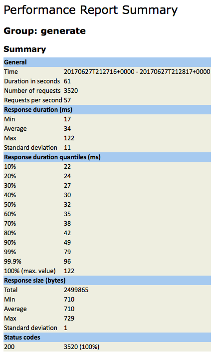

## **Introduction**

### **Summary**

HYPER is a homegrown Performance Testing Tool, build entirely from open source components, that enables engineers to execute performance tests on their own, without any dependencies. The user is able to monitor the test in Real Time, while the test is running, and at the end of the test get the Test Report over Email; and it can also be integrated with Slack, to receive the Test Report on the dedicated Slack Channel. It allows Engineers to build and modify tests quickly and easily, offering considerable time savings with minimal-to-none outside help.

### **Key Features**

*   Ability to run performance tests without performance engineering team involvement
*   No licensing or other third party costs involved, as the tool is build in-house from open source components
*   Estimated time-savings of 7 hours minimum of combined Performance+DevEngineer time for basic API tests
*   For existing tests, you can modify the API’s Endpoint URL, Data Files, Workload Model etc. quickly and, easily
*   Readily observe and identify your project’s performance trends and plan accordingly
*   The Slack integration allows you to post the test reports on the dedicated channel
*   All Stats are in one place; easy to understand your app/api performance at a glance
*   Ability to monitor your test in Real Time, while the test is executing
*   All Infrastructure in on _OneOps_ and it is easily scalable

### **Use Case**

**Testing a New or Existing API**

A developer wants to track the performance of an API call, a HTTP POST Method Call used to generate a promotional coupon as part of GOP - OneWalmart. They are interested in the following performance characteristics:

*   Response Time
*   Throughput

**Steps**

The developer starts by creating a Repository in GIT calling it, <a href="https://gecgithub01.walmart.com/CE-PERFREL/PromotionsCouponGeneratePost">PromotionsCouponGeneratePost</a> with public access; and adds a .perf file with the following entries:

*   Project Name: The project name should be the same name as the name of the Repository created in GIT
*   Method: Currently the two supported methods are GET and, POST
*   TotalVUs: The number of users to execute in parallel for this Use Case
*   StartVUs: The number of users to start-with and continue until the number of TotalVUs' is reached
*   Hold Rampup: How long, in minutes, the starting users will run before ramping up (the maximum is, 1 hour)
*   Duration: How long, in minutes, to continue running after the maximum number of users is reached (the maximum is, 1 hour)
*   Ramp up: How long, in seconds, to ramp-up the next set of StartVUs
*   API Name: The name of the testable API
*   URL: The end-point URL for the testable API (without including http:// or, https://)
*   Body: The body of the request (applicable for the, POST Method)
*   Headers: The Request Headers (for passing multiple headers, use tab as separator. Note, all header values must be on a single line)

The completed <a href="https://gecgithub01.walmart.com/CE-PERFREL/PromotionsCouponGeneratePost/blob/master/.perf">.perf</a> file checked into GIT should resemble the following:

    Project Name:	PromotionsCouponGeneratePost
    Method:	POST
    TotalVUs:	4
    StartVUs:	2
    Hold Rampup:	10
    Duration:	10
    Ramp up:	1
    API Name:	generate
    URL:	ws.qaint.promotionengine.walmart.com/promotion-app/rs/v2/coupons/generate
    Body:	{"payload":{"type":"SINGLE_USER","groupCode":"TEST_GROUP","cid":"efb36761-07a4-4bc4-9cbf-d1e347155dc9","source":"CCA","reason":"For goodwill coupon"}}
    API Name:	WM_CONSUMER.TENANT_ID:0	WM_CONSUMER.VERTICAL_ID:2	Content-Type:application/json	WM_SVC.ENV:dev	WM_SVC.NAMEWM_QOS.CORRELATION_ID:7acd4fa5-1b0e-496f-94a2-18f5fcb47315	WM_CONSUMER.ID:0

*   Add Project: Then, proceeds to <a href="http://hyper.walmart.com/create">add the project</a> to HYPER by providing the following information:

    *   Project Name: This will be the same name as the project name specified in the .perf file in GIT
    *   GIT Repo URL: This is the GIT Repo HTTPS endpoint URL (do not provide the SSH GIT-link for this)
    *   Email Id: The email ID for sending the performance report (use comma separated for multiple ID's)
    
*   Run Test: Finally, proceeds to run the test on <a href="http://hyper.walmart.com">HYPER</a> providing the following information:

    *   Project Name: This will be the same name as the project name specified in the .perf file in GIT
    *   GIT Repo URL: This is the GIT Repo HTTPS endpoint URL (do not provide the SSH GIT-link for this)
    *   Email Id: The email ID for sending the performance report (use comma separated for multiple ID's)

**Report**

*   Once the test is completed, a similar report will be generated and sent to the email provided during test execution

### **Architecture**

### **Feature List**

**Phase 1**

*   Ability to Execute Independently through the UI
*   One Step Ramp up Model
*   Both HTTP and HTTPS Protocols Available
*   HTTP Methods Available Include both GET and, POST
*   The Ability to Send Header Information as part of the Request
*   Adding Single Column Data Files in CSV Format
*   UI Showing Trend Graphs
*   UI Showing Test Status, whether the Test is Executing or, Queued
*   Slack Integration for Reporting
*   Email Integration for Sending Reports
*   Integration with GIT
*   Data Files, Workload and Use Case Modification

**Phase 2**

*   Multiple Step Ramp up Model
*   Integration with Medusa
*   Able to Hit Custom Port with the Request

### **Planned Features**

*   Run All Use Cases Sequentially at the Project Level
*   Text Validation on the Response
*   Ability to Use Random Variables
*   Ability to Use UUID Variable
*   .perf File Validation
*   VU's Graph on the UI
*   Ability to Stop the Test
*   Adding Wait Time between Requests
*   Enable Transactional or Workflow Model Flows
*   Passing Values between Requests
*   The Ability to Parse Response Data
*   The Ability to Provide a User Specified Slack Channel

### **Customers**

*   CAGM
*   GOP
*   Promotions
*   Sam’s Club
*   USGM

    **(Over 150 Projects Ported!)**
