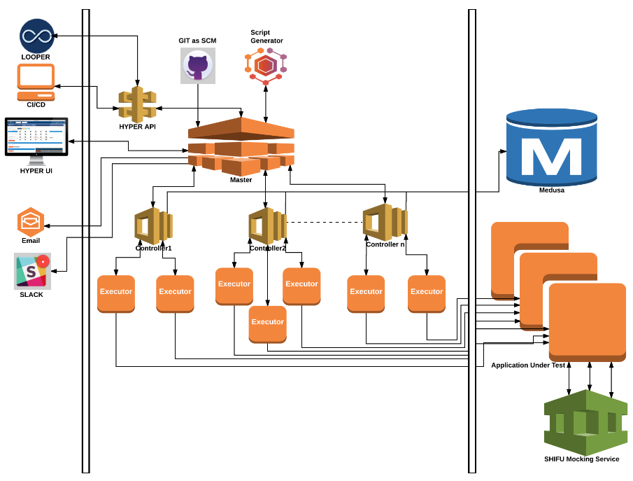

## **Introduction**

### **Summary**

HYPER is a homegrown Performance Testing Tool, build entirely from open source components, that enables engineers to execute performance tests on their own, without any dependencies. The user is able to monitor the test in Real Time, while the test is running, and at the end of the test get the Test Report over Email; and it can also be integrated with Slack, to receive the Test Report on the dedicated Slack Channel. It allows Engineers to build and modify tests quickly and easily, offering considerable time savings with minimal-to-none outside help.

### **Key Features**

*   Ability to run performance tests without performance engineering team involvement
*   No licensing or other third party costs involved, as the tool is build in-house from open source components
*   Estimated time-savings of 7 hours minimum of combined Performance+DevEngineer time for basic API tests
*   For existing tests, you can modify the API’s Endpoint URL, Data Files, Workload Model etc. quickly and, easily
*   Readily observe and identify your project’s performance trends and plan accordingly
*   The Slack integration allows you to post the test reports on the dedicated channel
*   All Stats are in one place; easy to understand your app/api performance at a glance
*   Ability to monitor your test in Real Time, while the test is executing
*   All Infrastructure in on _OneOps_ and it is easily scalable

### **Use Case**

**Testing a New or Existing API**

A developer wants to track the performance of an API call, a HTTP POST Method Call used to generate a promotional coupon as part of GOP - OneWalmart. They are interested in the following performance characteristics:

*   Response Time
*   Throughput

**Steps**

The developer starts by creating a Repository in GIT calling it, <a href="https://gecgithub01.walmart.com/CE-PERFREL/PromotionsCouponGeneratePost">PromotionsCouponGeneratePost</a> with public access; and adds a .perf file with the following entries:

*   Project Name: The project name should be the same name as the name of the Repository created in GIT
*   Method: Currently the two supported methods are GET and, POST
*   TotalVUs: The number of users to execute in parallel for this Use Case
*   StartVUs: The number of users to start-with and continue until the number of TotalVUs' is reached
*   Hold Rampup: How long, in minutes, the starting users will run before ramping up (the maximum is, 1 hour)
*   Duration: How long, in minutes, to continue running after the maximum number of users is reached (the maximum is, 1 hour)
*   Ramp up: How long, in seconds, to ramp-up the next set of StartVUs
*   API Name: The name of the testable API
*   URL: The end-point URL for the testable API (without including http:// or, https://)
*   Body: The body of the request (applicable for the, POST Method)
*   Headers: The Request Headers (for passing multiple headers, use tab as separator. Note, all header values must be on a single line)

The completed <a href="https://gecgithub01.walmart.com/CE-PERFREL/PromotionsCouponGeneratePost/blob/master/.perf">.perf</a> file checked into GIT should resemble the following:

    Project Name:	PromotionsCouponGeneratePost
    Method:	POST
    TotalVUs:	4
    StartVUs:	2
    Hold Rampup:	10
    Duration:	10
    Ramp up:	1
    API Name:	generate
    URL:	ws.qaint.promotionengine.walmart.com/promotion-app/rs/v2/coupons/generate
    Body:	{"payload":{"type":"SINGLE_USER","groupCode":"TEST_GROUP","cid":"efb36761-07a4-4bc4-9cbf-d1e347155dc9","source":"CCA","reason":"For goodwill coupon"}}
    API Name:	WM_CONSUMER.TENANT_ID:0	WM_CONSUMER.VERTICAL_ID:2	Content-Type:application/json	WM_SVC.ENV:dev	WM_SVC.NAMEWM_QOS.CORRELATION_ID:7acd4fa5-1b0e-496f-94a2-18f5fcb47315	WM_CONSUMER.ID:0

*   Add Project: Then, proceeds to <a href="http://hyper.walmart.com/create">add the project</a> to HYPER by providing the following information:

    *   Project Name: This will be the same name as the project name specified in the .perf file in GIT
    *   GIT Repo URL: This is the GIT Repo HTTPS endpoint URL (do not provide the SSH GIT-link for this)
    *   Email Id: The email ID for sending the performance report (use comma separated for multiple ID's)
    
*   Run Test: Finally, proceeds to run the test on <a href="http://hyper.walmart.com">HYPER</a> providing the following information:

    *   Project Name: This will be the same name as the project name specified in the .perf file in GIT
    *   GIT Repo URL: This is the GIT Repo HTTPS endpoint URL (do not provide the SSH GIT-link for this)
    *   Email Id: The email ID for sending the performance report (use comma separated for multiple ID's)

**Report**

*   Once the test is completed, a similar report will be generated and sent to the email provided during test execution

### **Architecture**

### **Feature List**

**Production Performance test**

*   MVP: Able to run from public cloud - No AWS agents
*   MVP: Locations for Public cloud agents (US)
*   Locations for Public cloud agents (UK, Canada)
*   MVP: Able to handle - 60M PageViews/Hr and 10K OPM at minimum
*   MVP: Able to control individual scripts’ VUs while test execution
*   Enable certain percentage to log request and response data in the test tool

**Internal Performance Test**

*   MVP: Able to reach ~60K TPS

**Test Manager**

*   MVP: Should spin up test controllers
*   Control load based on feedback data (ramp up, down or stop) for complex load tests (multiple components, end-to-end)
    *   Need to define feedback data for ramping
*   MVP: Start, stop, abort tests
*   MVP: Kill switch for individual sub-test or overall tests
*   Schedule tests
*   MVP: Gating: detect overlap and limit
*   Service discovery
*   MVP: Queueing of tests
*   MVP: Ability to spin up test infrastructure by OneOps Org

**Test Project and User Portal**

*   MVP: Roles Management (Assign 5 Roles: Super Admin, Admin, Performance Engineer, Read Only, Anonymous)
*   MVP: Ability to login using HO userid
*   MVP: View and compare historic results
*   MVP: Ability to upload test projects (.jmx and .yaml)
*   MVP: Maintain uploaded tests plans for future reference
*   MVP: Ability to kickoff tests from GIT repo

**Test Controllers**

*   MVP: Spin up and control the executors dynamically based on defined load and state of the executers (auto-scale)
*   MVP: Monitor executors, OS level, error counts, etc.
*   MVP: Controller needs to aggregate test results.
*   MVP: Kill runaway executors

**Scripting**

*   Recording the flow
*   MVP: Adding validation on response (HTTP response codes are not sufficient, need to check for internal error codes ann response data)
*   MVP: Correlate response and parse (complex flows, using response data for subsequent requests, need to be available for body, header and URL)
*   MVP: Support create random input data for requests for strings and other data type, should be able to utilize external code.
*   MVP: Multi column CSV file (seed data where one column in row depends on a value from another column)
*   Script validation
*   MVP: Ability to suppress images and 3rd party requests (example: no calls to Visa for checkout flows, suppress ads, etc. )
*   Ability to suppress specific errors or warnings
*   Multiple ways of error handling
    *   MVP: Stop on error
    *   Continue on error
    *   Retry on error (specify max number of retries, retry from step one of flow)
*   MVP: Headers (add customer header to request, manipulate header, add, modify or remove stuff from headers)
*   MVP: Cookies management (e.g. add, remove, change value, delete all or subset of cookies for domain in test browser)
*   Enable or disable caching option - All request will be like first time visitor
*   MVP: Disable caching option - All request will be like first time visitor
*   MVP: Ability to hit specific ports for IPs, host names or VIPs
*   Profile types and user types (e.g. debug users, enable debug information for subset of test users, flows can also differ between user types. leave out steps, use different path)
*   MVP: Different type of workload modeling (e.g. dynamic ramp-up and down based on feedback, ability to script not dynamic ramp up and down)
*   Import and export projects (build new test scripts based on existing scripts)
*   Debug statements on log files (include additional information to log files for script debugging purposes)
*   MVP: Session management (test user)
*   Cross browser and device support (specify browser/ device mix in script, also ability to simulate network speed by device)
*   MVP: Think and pacing for user actions
*   Synchronization functions (control how many users execute a particular step at the same time)
*   Define granularity of real-time result reporting, also applies to reporting in general
*   MVP: Ability to define custom timers (e.g. single time for multiple steps)
*   MVP: Auto Test plan generation for single API/service test
*   Custom functions, i.e. reusable, extensible library of common somewhat high-level functionality

**Real Time Monitoring**

*   MVP: For each Request Response Time count, min, max and Avg per sec
*   MVP: Hits/sec
*   MVP: Errors/sec
*   MVP: HTTP Pages/sec

**Reporting**

*   MVP: Summary Report
*   MVP: Real-time Time series data
*   MVP: Page level stats
*   Graph for all the data related to test
*   MVP: Error Info (Breakdown by response/code or error code)
*   Network stats
*   Integrate with APP and OS metrics
*   CDN/Torbit data
*   DB data
*   MVP: Test infrastructure utilization (scheduled tests, test run status, #tests running, #tests scheduled, #tests finished)
*   MVP: Test Data persistence
*   MVP: Ability to compare results between different runs
*   MVP: Email results
*   MVP: Integration with Slack

**CI CD/Self-Service/On-Demand**

*   MVP: Gating - Service Dependency
*   MVP: Throttling – Duration, No of threads, environment
*   MVP: Mocking for CI/CD and Component Tests
*   Restrictions – (only non-prod)
*   Quota and priority (e.g. locks)
*   DC Level or cloud level selection with localized test executors
*   MVP: Single-Sign on for On-Demand/Self Service
*   MVP: Audit Trail

### **Customers**

*   CAGM
*   GOP
*   Promotions
*   Sam’s Club
*   USGM
*   Walmart Core

    **(Over 150 Projects Ported!)**
